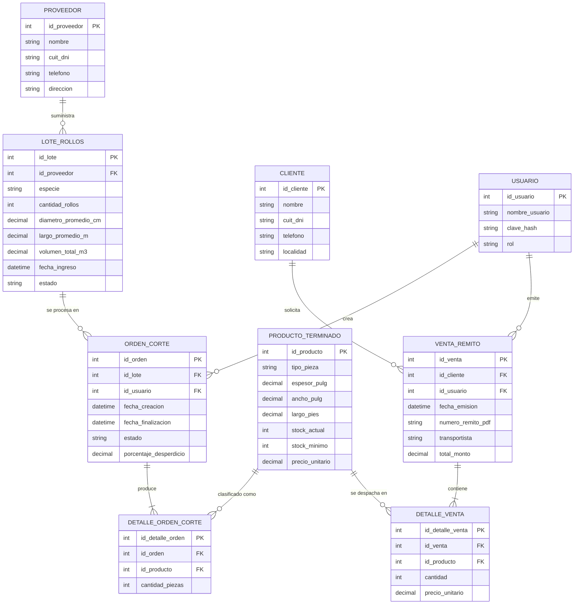

```mermaid
erDiagram
    PROVEEDOR ||--o{ LOTE_ROLLOS : "suministra"
    LOTE_ROLLOS ||--o{ ORDEN_CORTE : "se procesa en"
    ORDEN_CORTE ||--|{ DETALLE_ORDEN_CORTE : "produce"
    PRODUCTO_TERMINADO ||--o{ DETALLE_ORDEN_CORTE : "clasificado como"
    
    CLIENTE ||--o{ VENTA_REMITO : "solicita"
    VENTA_REMITO ||--|{ DETALLE_VENTA : "contiene"
    PRODUCTO_TERMINADO ||--o{ DETALLE_VENTA : "se despacha en"

    USUARIO ||--o{ ORDEN_CORTE : "crea"
    USUARIO ||--o{ VENTA_REMITO : "emite"

    PROVEEDOR {
        int id_proveedor PK
        string nombre
        string cuit_dni
        string telefono
        string direccion
    }

    LOTE_ROLLOS {
        int id_lote PK
        int id_proveedor FK
        string especie
        int cantidad_rollos
        decimal diametro_promedio_cm
        decimal largo_promedio_m
        decimal volumen_total_m3
        datetime fecha_ingreso
        string estado
    }

    ORDEN_CORTE {
        int id_orden PK
        int id_lote FK
        int id_usuario FK
        datetime fecha_creacion
        datetime fecha_finalizacion
        string estado
        decimal porcentaje_desperdicio
    }

    DETALLE_ORDEN_CORTE {
        int id_detalle_orden PK
        int id_orden FK
        int id_producto FK
        int cantidad_piezas
    }

    PRODUCTO_TERMINADO {
        int id_producto PK
        string tipo_pieza
        decimal espesor_pulg
        decimal ancho_pulg
        decimal largo_pies
        int stock_actual
        int stock_minimo
        decimal precio_unitario
    }

    CLIENTE {
        int id_cliente PK
        string nombre
        string cuit_dni
        string telefono
        string localidad
    }

    VENTA_REMITO {
        int id_venta PK
        int id_cliente FK
        int id_usuario FK
        datetime fecha_emision
        string numero_remito_pdf
        string transportista
        decimal total_monto
    }

    DETALLE_VENTA {
        int id_detalle_venta PK
        int id_venta FK
        int id_producto FK
        int cantidad
        decimal precio_unitario
    }

    USUARIO {
        int id_usuario PK
        string nombre_usuario
        string clave_hash
        string rol
    }
```